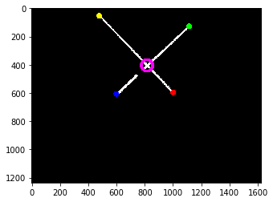
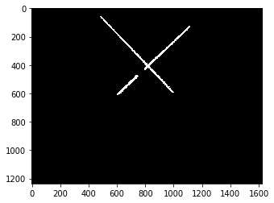

# OpenCV激光中心与端点识别-1Z实验室


出品：1Z实验室 （1ZLAB： Make Things Easy）

## 概要

下面的这张图片是十字激光的图像， 当前我们的任务就是要识别十字的四个端点还有十字中心。

这个缺口就是螺丝的孔位，所以你获得的图像可能是片段的，不一定连续。


我们用不同的颜色标示不同的端点， 空心圆代表交点。




## 算法流程讲解


### 1-图像二值化




二值化排除其他干扰。

```python
binary = cv2.inRange(gray, 200, 255)
```


### 2-拟合线段与直线


用`HoughLineP` 进行线段拟合。

```python
line_segs = cv2.HoughLinesP(binary, rho=2,theta=0.1, threshold=100)
len(line_segs)
```


`HoughLineP`返回的是数组，每个元素是`Tuple`类型的数据。还是要打印一下这个数据结构。

```python
import math

for lseg in line_segs:
    # 
    x1,y1,x2,y2 = lseg[0]
    # 计算权重
    weight = math.sqrt(math.pow(x1-x2, 2) + math.pow(y1-y2, 2))
    print('x1: {}, y1: {}, x2: {}, y2: {}, weight: {}'.format(x1, y1, x2, y2, weight))
    
```

**打印结果**

线段的标示方法是记录线段的两个端点， 从`(x1, y1)` 点到`（x2, y2)` 点。

数组的个数，取决于你的调参，从十几个到几百个不等。 

```
x1: 817, y1: 408, x2: 1068, y2: 164, weight: 350.0528531522061
x1: 525, y1: 93, x2: 868, y2: 468, weight: 508.20665088131227
x1: 630, y1: 202, x2: 818, y2: 408, weight: 278.89065957826557
x1: 488, y1: 56, x2: 814, y2: 412, weight: 482.7131653477042
x1: 816, y1: 407, x2: 960, y2: 267, weight: 200.83824337013107
x1: 714, y1: 520, x2: 714, y2: 520, weight: 0.0
x1: 845, y1: 391, x2: 1113, y2: 131, weight: 373.39523296367884
x1: 698, y1: 275, x2: 817, y2: 404, weight: 175.50498568416796
....
```


把线段的**长度** 作为这个线段的**权重 Weight**。

```python
 weight = math.sqrt(math.pow(x1-x2, 2) + math.pow(y1-y2, 2))
```

每个线段都可以求解出这个线段所在直线的`k`还有`b`. 

```python
y = k*x + b
```

求解`k`，`b`的算法比较简单，需要借助初中所学的知识。

```python
def calculate_line(x1, y1, x2, y2):
    '''
    计算直线
    如果直线水平或者垂直，统一向一个方向倾斜特定角度。
    TODO 这里面没有考虑水平或者垂直的情况
    '''
    if x1 > x2:
        x1,y1,x2,y2 = x2,y2,x1,y1
    if x1 == x2 or y1 == y2:
        # 有时候会出现单个像素点 x1 = x2 而且 y1 = y2
        print('x1:{} y1:{} x2:{} y2:{}'.format(x1, y1, x2, y2))
    k = (y1 - y2) / (x1 - x2)
    b = (y2 * x1 - y1*x2) / (x1 - x2)
    
    return k,b
```


### 3-合并线段

我们需要把这几百个线段拟合成**两条直线**， 这个**2** 属于我们的先验知识。


遍历所有的线段，求解其`k`， `b` 还有对应的`weight`。

然后我们通过字典数据结构来存放合并过后的**直线**。 数据结构细节如下：

| 参数       | 备注                          |
| ---------- | ----------------------------- |
| cur_k      | 当前合并的直线的K值           |
| cur_b      | 当期合并的直线的b值           |
| k_sum      | K值的带权累加和               |
| b_sum      | b值的带权累加和               |
| weight_sum | 权重和                        |
| x1         | 合并后大线段的左侧端点的x坐标 |
| y1         | 合并后大线段的左侧端点的y坐标 |
| x2         | 合并后大线段的右侧端点的x坐标 |
| y2         | 合并后大线段的右侧端点的y坐标 |

所有合并后的直线/线段，存放在`lines`里面， 每个线段在合并的时候，遍历lines里面合并后的线段，通过`k`的差值（`max_k_distance`）判断是否属于同一个直线，如果里面都没有的话就另外添加一个。


```python

lines = []
# 最小权值
min_weight = 20
# 相同k之间最大的差距
max_k_distance = 0.3

for lseg in line_segs:
    # 获取线段端点值
    x1,y1,x2,y2 = lseg[0]
    if x1 > x2:
        x1, y1, x2, y2 = x2, y2, x1, y1
        
    # 计算权重
    weight = math.sqrt(math.pow(x1 - x2, 2) + math.pow(y1 - y2, 2))
    
    if weight != 0 and weight > min_weight:
        # 计算K与b
        k, b = calculate_line(x1, y1, x2, y2)
        # print('k: {:.2f}, b: {:.2f}, weight: {:.2f}'.format(k, b, weight))
        
        if len(lines) == 0:
            # 初次填充line
            line = {}
            line['cur_k'] = k
            line['cur_b'] = b
            line['k_sum'] = k * weight
            line['b_sum'] = b * weight
            line['weight_sum'] = weight
            line['x1'] = x1
            line['y1'] = y1
            line['x2'] = x2
            line['y2'] = y2
            lines.append(line)
            continue
        
        # 根据k的差异做加权
        # 首先获取lines数组里面k举例最近的那个
        
        neighbor_line = min(lines, key=lambda line:abs(line['cur_k'] - k))
        
        if  abs(neighbor_line['cur_k'] - k) < max_k_distance:
            # 小于最大k差值，认为是同一条线
            
            neighbor_line['weight_sum'] += weight
            neighbor_line['k_sum'] += k * weight
            neighbor_line['b_sum'] += b * weight
            neighbor_line['cur_k'] = neighbor_line['k_sum'] / neighbor_line['weight_sum']
            neighbor_line['cur_b'] = neighbor_line['b_sum'] / neighbor_line['weight_sum']
            
            if neighbor_line['x1'] > x1:
                neighbor_line['x1'] = x1
                neighbor_line['y1'] = y1
                
            if neighbor_line['x2'] < x2:
                neighbor_line['x2'] = x2
                neighbor_line['y2'] = y2
            
        else:
            # 添加另外一条线
            # 初次填充line
            line = {}
            line['cur_k'] = k
            line['cur_b'] = b
            line['k_sum'] = k * weight
            line['b_sum'] = b * weight
            line['weight_sum'] = weight
            line['x1'] = x1
            line['y1'] = y1
            line['x2'] = x2
            line['y2'] = y2
            lines.append(line)

```

做完上述的操作之后，我们获取的`lines`的长度可能不是2, 可能会大于2. 所以我们可以根据`weight_sum`对`lines`进行重新排序， 然后截取前两个，作为激光十字的两条直线。


```python
# 根据权重对lines数组进行排序， 取前两个（lines的长度有可能大于2）
sorted_lines = sorted(lines, key=lambda line: line['weight_sum'])[::-1]
line1 = sorted_lines[0]
line2 = sorted_lines[1]
```


```python
[{'b_sum': -3304027.8377846032,
  'cur_b': -482.1075439824276,
  'cur_k': 1.0900334200603314,
  'k_sum': 7470.32650483927,
  'weight_sum': 6853.300428555484,
  'x1': 478,
  'x2': 1001,
  'y1': 54,
  'y2': 597},
 {'b_sum': 8948293.312710544,
  'cur_b': 1209.7121822845368,
  'cur_k': -0.9799324921216083,
  'k_sum': -7248.603010345705,
  'weight_sum': 7397.043233715087,
  'x1': 599,
  'x2': 1113,
  'y1': 607,
  'y2': 129}]
```


### 4-计算交点


```python
def calculate_intersection(line1, line2):
    a1 = line1['y2'] - line1['y1']
    b1 = line1['x1'] - line1['x2']
    c1 = line1['x2'] * line1['y1'] - line1['x1'] * line1['y2']
    
    a2 = line2['y2'] - line2['y1']
    b2 = line2['x1'] - line2['x2']
    c2 = line2['x2'] * line2['y1'] - line2['x1'] * line2['y2']
    
    if (a1 * b2 - a2 * b1) != 0 and (a2 * b1 - a1 * b2) != 0:
        cross_x = int((b1*c2-b2*c1)/(a1*b2-a2*b1))
        cross_y = int((c1*a2-c2*a1)/(a1*b2-a2*b1))
        return (cross_x, cross_y)
    return None
```
计算交点：

```python
(cx, cy) = calculate_intersection(line1, line2)
print('cx: {} cy: {}'.format(cx, cy))
```

```
cx: 816 cy: 405
```


### 5-信息可视化

在画面上绘制四个端点与中心交点：


```python
canvas = cv2.cvtColor(binary, cv2.COLOR_GRAY2BGR)

# 绘制第一条线
pt_radius = 20
cv2.circle(canvas, (line1['x1'], line1['y1']),pt_radius, (255, 0, 0), thickness=-1)
cv2.circle(canvas, (line1['x2'], line1['y2']),pt_radius, (0, 255, 0), thickness=-1)
cv2.circle(canvas, (line2['x1'], line2['y1']),pt_radius, (0, 255, 255), thickness=-1)
cv2.circle(canvas, (line2['x2'], line2['y2']),pt_radius, (0, 0, 255), thickness=-1)

cv2.circle(canvas, (cx, cy), 40, (255, 0, 255), thickness=20)

plt.imshow(cv2.cvtColor(canvas, cv2.COLOR_BGR2RGB))
plt.show()
```


## 推广

出品：1Z实验室 （1ZLAB： Make Things Easy）

扫码关注微信公众号**1Z实验室**， 回复关键词**激光十字源码** 获取源码。

1Z实验室 Make Things Easy . 致力于在机器人+计算机视觉+人工智能的重叠区域, 制作小白友好的教程.

